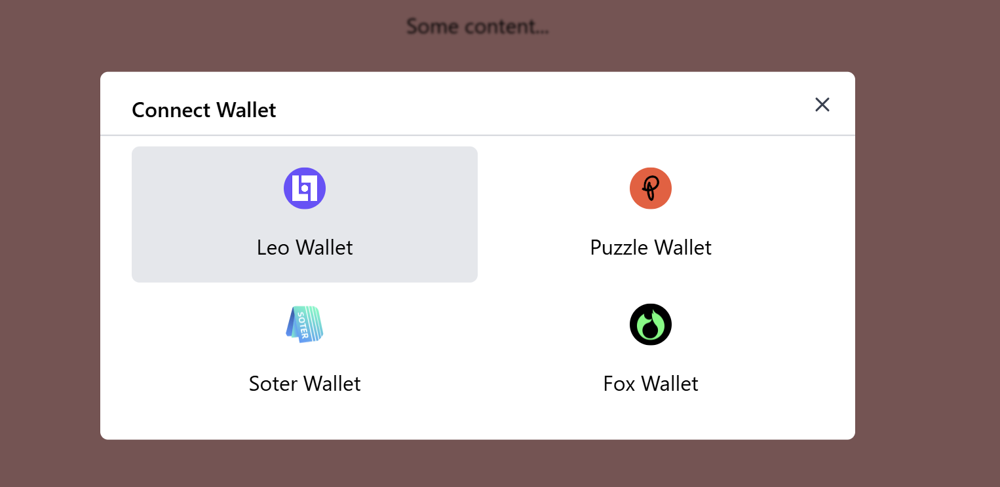

This project demonstrates how to integrate a wallet adapter in the frontend for Aleo.

### Setup Instructions:

1. **Install Node Modules:**

   To install the necessary dependencies, run:

   ```bash
   npm install
   ```

2. **Start the App in Development Mode:**

   To start the application, run the following command:

   ```bash
   npm run dev
   ```

   Your app will be accessible at [http://localhost:5173/](http://localhost:5173/).

### Using the App:

Once the app is running, you’ll see the UI with a **Connect Wallet** button in the top right corner. Upon clicking this button, you'll see a list of four wallets that can be used to connect to Aleo.



